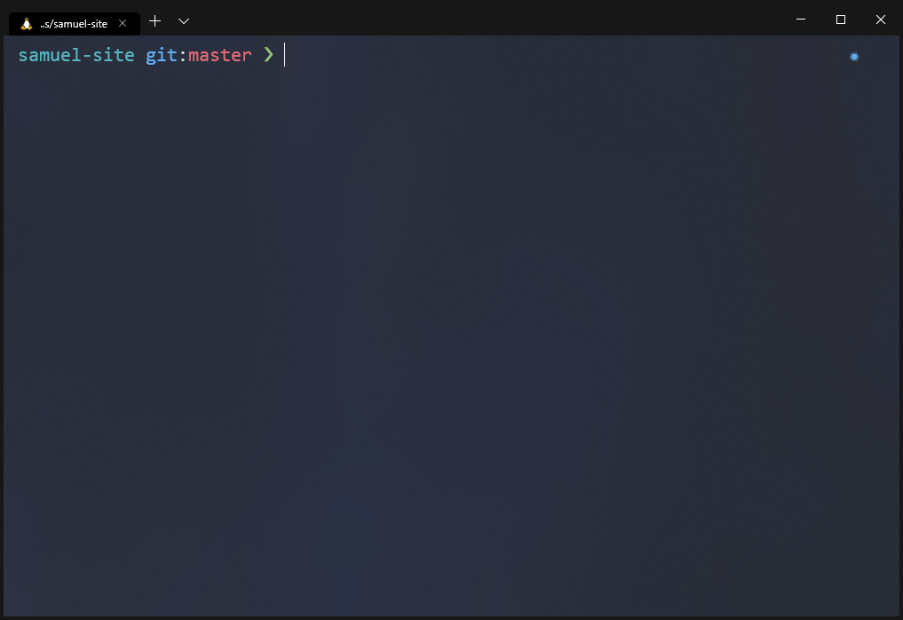

# Config :hammer_and_wrench:

Configuration files and setup instructions for my terminal setup and preferences.



## Tools

- Windows Terminal (with Hyper as backup)
- ZSH/Oh My ZSH (sorin theme)
- NVM
- RVM
- Yarn

## Get Started

1. Clone repo

   ```shell
   git clone git@github.com:carbonsam/config.git
   ```

1. Execute the setup script:

   ```shell
   sudo ./setup.sh
   ```
